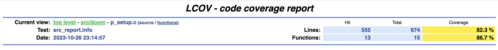
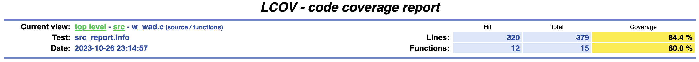
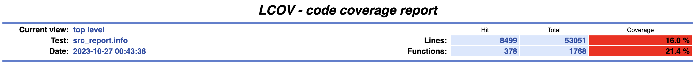
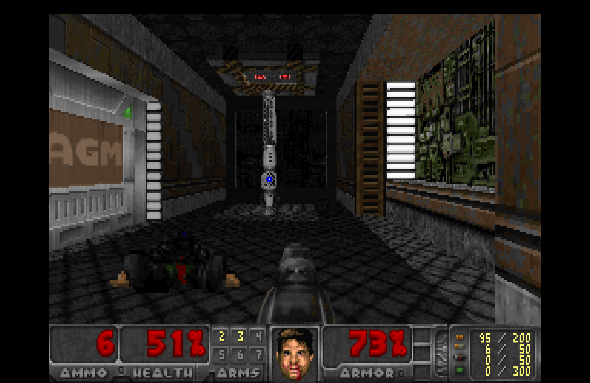

# REPORT

## Personal Information
- Student Name: Weiqiang Yu
- Student ID: 21020022
- WatID: w8yu

## What have been done to compile and run the code
This project primarily follows the steps defined in GitLab.(https://git.uwaterloo.ca/stqam-1239/skeleton/-/tree/main/fb?ref_type=heads#doom).

Since my computer is Mac M1, the fuzzer was run using the uwstqam/fuzz-doom:m1 Docker image. The following command was used to start the Docker container:
```bash
docker run -dit --name FuzzDoom uwstqam/fuzz-doom:m1
```

A shell script named runFuzz.sh was created to automate the fuzzer's basic steps, which include:
1. Building the project using CMake and Ninja.
2. Removing unnecessary files.
3. Initiating the fuzzing process.
4. Generating a coverage report.

The script is available in the same folder, and it can be executed with the command:
```bash
 # execute this command at /fb/build folder
 ./runFuzz.sh
```

In order to view the HTML output within the local environment, I employed the Docker bind mounts functionality to facilitate access to files within the container from the local machine. The command to achieve this is as follows:

```bash
docker run -dit --name FuzzDoom -v "$(pwd)"/fb:/home/doom/fb uwstqam/fuzz-doom:m1
```
## What have been done to increase the coverage

- The initial attempt to increase code coverage involved downloading multiple WAD files, but it did not significantly impact the coverage. A more effective approach was adopted

- The source code files p_setup.c and w_wad.c were analyzed, and functions from these files were called directly from the fuzz_target file. For instance, while inspecting w_wad.c, I identified sections of code that requires the first character of the filename being "~" and the filename extension not being .wad. To address this, I generated a new file named "~fuzz.txt" to cover these specific scenarios. Ultimately, I managed to increase the code coverage for these two files – p_setup.c reached 82.3%, and w_wad.c hit 84.4%.


However, by doing this, I was only able to boost coverage for those two specific files, leaving the overall line coverage at around 9%. To overcome this limitation, I took a more comprehensive approach. I started checking all the files one by one to see if I could increase the code coverage further. For example, I added new command line arguments like "-mmap" to cover additional paths. What's more, I also directly called some of the functions that weren't covered before. For instance, I dived into the "d_mode.c" file and found many functions that hadn't been touched. So, I went ahead and called these functions in "fuzz_target.c," supplying them with the right parameters, like this:
```bash
D_ValidGameVersion(gamemission, gameversion);
```

This increased the line coverage to 16% and the functional coverage to 21.4%.

## What bugs have been found? Can you replay the bug with chocolate-doom, not with the fuzz target?
No bugs were found during the fuzzing process.

## Did you manage to compile the game and play it on your local machine (Not inside Docker)?
The game was successfully compiled and played on the local machine. A screenshot of the gameplay is available as follows:
